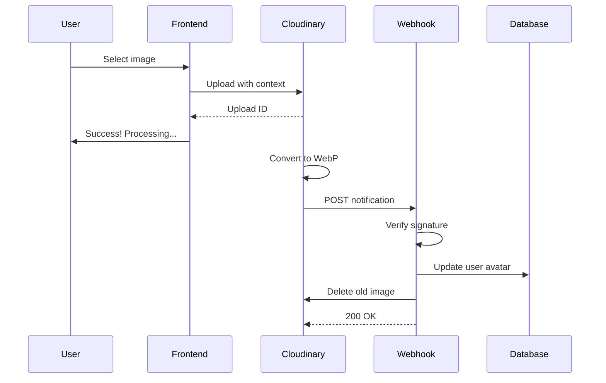

# Cloudinary Background Image Processing System

A complete Next.js implementation for handling async image uploads with Cloudinary webhooks, featuring signature verification, automatic WebP conversion, and background processing.

## 🎯 Overview

This system allows users to upload images that are processed in the background by Cloudinary. Users receive immediate feedback and can navigate away while the image is converted to WebP format. Once processing completes, a webhook updates the database and cleans up old images.

## ✨ Features

- **Async Processing**: Non-blocking uploads with background conversion
- **Security**: SHA256 signature verification prevents unauthorized webhooks
- **WebP Conversion**: Automatic format conversion for optimal file sizes
- **Auto Cleanup**: Old images are automatically deleted
- **User Feedback**: Immediate success messages with processing status
- **Error Handling**: Comprehensive validation and error messages
- **Monitoring**: Built-in webhook logging for debugging
- **Testing**: Automated test scripts included

## 📦 What's Included

### Core Files
- `pages/api/webhooks/cloudinary.js` - Webhook handler with signature verification
- `src/components/CloudinaryImageUpload.jsx` - React upload component
- `src/components/ProfileImageUploadExample.jsx` - Complete usage example
- `src/utils/cloudinary.js` - Utility functions for image operations

### Testing & Monitoring
- `test-webhook.js` - Automated webhook testing script
- `pages/api/webhooks/cloudinary-logs.js` - Webhook activity logging

### Documentation
- `CLOUDINARY_WEBHOOK_SETUP.md` - Complete setup instructions
- `INTEGRATION_GUIDE.md` - Step-by-step integration guide
- `IMPLEMENTATION_SUMMARY.md` - Technical implementation details
- `QUICK_REFERENCE.md` - Quick reference card
- `.env.example` - Environment variable template

## 🚀 Quick Start

### 1. Install Dependencies

```bash
npm install cloudinary
```

### 2. Configure Environment

Your `.env` is already configured:
```env
CLOUDINARY_CLOUD_NAME=df3zptxqc
CLOUDINARY_API_SECRET=uirTywUnt8m1Sq0J1-FswKXzeAo
NEXT_PUBLIC_CLOUDINARY_CLOUD_NAME=df3zptxqc
```

### 3. Create Cloudinary Upload Preset

1. Go to [Cloudinary Console](https://console.cloudinary.com/settings/upload)
2. Click "Add upload preset"
3. Configure:
   - **Name**: `profile_images`
   - **Signing mode**: Unsigned
   - **Folder**: `user_avatars`
   - **Format**: WebP
   - **Async upload**: ✅ **ENABLED**
   - **Notification URL**: `https://yourdomain.com/api/webhooks/cloudinary`

### 4. Implement Database Update

Edit `pages/api/webhooks/cloudinary.js` (line 82):

```javascript
async function updateDatabase(userId, imageUrl) {
    const User = require("@/server/models/user");
    await User.findByIdAndUpdate(userId, { 
        avatar: imageUrl,
        updatedAt: new Date()
    });
    return { success: true, userId, imageUrl };
}
```

### 5. Add to Your UI

```jsx
import CloudinaryImageUpload from "@/components/CloudinaryImageUpload";
import { getUserToken } from "@/utils/getUserToken";

function ProfilePage() {
    const userId = getUserToken();
    
    return (
        <CloudinaryImageUpload
            userId={userId}
            uploadPreset="profile_images"
            currentImagePublicId={userData?.avatarPublicId}
            onUploadStart={(data) => {
                console.log("Upload started:", data);
            }}
        />
    );
}
```

### 6. Test Locally

```bash
# Start dev server
npm run dev

# In another terminal, run test
npm run test:webhook
```

### 7. Deploy

1. Deploy your Next.js app
2. Update Cloudinary webhook URL to: `https://yourdomain.com/api/webhooks/cloudinary`
3. Test with a real upload

## 🔒 Security

### Signature Verification

Every webhook request is verified using:

```
SHA256(body + timestamp + api_secret)
```

This ensures:
- Requests actually come from Cloudinary
- Data hasn't been tampered with
- Protection against replay attacks

### Implementation

```javascript
function verifySignature(body, timestamp, signature) {
    const expectedSignature = crypto
        .createHash("sha256")
        .update(body + timestamp + apiSecret)
        .digest("hex");
    
    return crypto.timingSafeEqual(
        Buffer.from(signature),
        Buffer.from(expectedSignature)
    );
}
```

## 📊 How It Works

### Upload Flow



### Webhook Payload

```json
{
    "notification_type": "upload",
    "public_id": "user_avatars/abc123",
    "secure_url": "https://res.cloudinary.com/.../image.webp",
    "format": "webp",
    "context": {
        "custom": {
            "userId": "user123",
            "oldPublicId": "user_avatars/old456"
        }
    }
}
```

## 🧪 Testing

### Automated Testing

```bash
npm run test:webhook
```

### Local Testing with ngrok

```bash
# Terminal 1: Start dev server
npm run dev

# Terminal 2: Expose with ngrok
npx ngrok http 3000

# Update Cloudinary webhook URL to ngrok URL
# Upload an image and check logs
```

### View Webhook Logs

```bash
curl http://localhost:3000/api/webhooks/cloudinary-logs?limit=10
```

## 📚 Documentation

| Document | Description |
|----------|-------------|
| [Setup Guide](./CLOUDINARY_WEBHOOK_SETUP.md) | Complete setup instructions |
| [Integration Guide](./INTEGRATION_GUIDE.md) | Step-by-step integration |
| [Implementation Summary](./IMPLEMENTATION_SUMMARY.md) | Technical details |
| [Quick Reference](./QUICK_REFERENCE.md) | Quick reference card |

## 🎨 Component API

### CloudinaryImageUpload

```jsx
<CloudinaryImageUpload
    userId={string}                    // Required: User ID
    uploadPreset={string}              // Required: Cloudinary preset
    currentImagePublicId={string}      // Optional: For deletion
    onUploadStart={function}           // Optional: Callback
    onUploadComplete={function}        // Optional: Callback
/>
```

## 🛠️ Utility Functions

```javascript
import {
    getOptimizedImageUrl,
    validateImageFile,
    extractPublicId,
    formatFileSize
} from "@/utils/cloudinary";

// Get optimized URL
const thumbnail = getOptimizedImageUrl(url, "thumbnail");

// Validate file
const { valid, error } = validateImageFile(file);

// Extract public_id
const publicId = extractPublicId(cloudinaryUrl);

// Format size
const size = formatFileSize(1024000); // "1 MB"
```

## 🐛 Troubleshooting

### Webhook Not Called
- ✅ Check Cloudinary webhook logs in dashboard
- ✅ Verify "Async upload" is enabled in preset
- ✅ Ensure notification URL is publicly accessible
- ✅ Check URL has no typos

### Signature Verification Fails
- ✅ Verify `CLOUDINARY_API_SECRET` matches dashboard
- ✅ Check server time is synchronized
- ✅ Ensure raw body parsing is enabled

### Database Not Updating
- ✅ Implement `updateDatabase()` function
- ✅ Verify database connection
- ✅ Check userId is passed correctly
- ✅ Review server logs for errors

### Old Images Not Deleting
- ✅ Pass `currentImagePublicId` prop
- ✅ Verify public_id format matches Cloudinary
- ✅ Check Cloudinary API credentials
- ✅ Review deletion logs

## 📈 Monitoring

### Webhook Activity

```bash
# View recent webhooks
GET /api/webhooks/cloudinary-logs?limit=50
```

### Log Format

```json
{
    "timestamp": "2024-01-15T10:30:00.000Z",
    "status": "success",
    "notification_type": "upload",
    "public_id": "user_avatars/abc123",
    "userId": "user123"
}
```

## 🎯 Use Cases

- **Profile Pictures**: User avatar uploads
- **Event Covers**: Event banner images
- **Community Banners**: Community header images
- **Product Images**: E-commerce product photos
- **Gallery Uploads**: User-generated content

## 🔄 Next Steps

1. **Error Monitoring**: Integrate Sentry or similar
2. **Rate Limiting**: Add upload quotas per user
3. **Image Validation**: Check dimensions and content
4. **Progress Tracking**: Show real-time upload progress
5. **Retry Logic**: Handle failed webhooks
6. **Analytics**: Track upload success rates

## 📞 Support

- **Cloudinary Docs**: https://cloudinary.com/documentation
- **Webhook Guide**: https://cloudinary.com/documentation/notifications
- **Support**: https://support.cloudinary.com

## 📄 License

This implementation is part of your UniHub project.

---

**Ready to get started?** Follow the [Integration Guide](./INTEGRATION_GUIDE.md) for step-by-step instructions.
